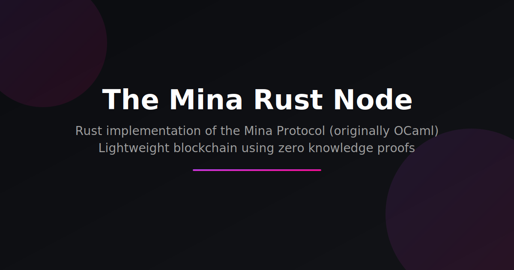

  

![Beta][beta-badge] [![release-badge]][release-link]

[![Changelog][changelog-badge]][changelog] [![Apache licensed]][Apache link]

_The **Mina Rust Node** is a fast and secure implementation of the Mina protocol
in **Rust**._ _Currently in **public beta**, join our
[Discord community](https://discord.com/channels/484437221055922177/1290662938734231552)
to help test future releases._

---

## What is Mina Protocol?

Mina is a lightweight blockchain using zero-knowledge proofs to maintain a
constant blockchain size, making it the world's lightest blockchain. Learn more
at **[minaprotocol.com](https://minaprotocol.com)**.

## Quick Start

**[View full system requirements and setup instructions →](https://o1-labs.github.io/mina-rust/docs/node-operators/getting-started)**

## Getting Started

For comprehensive installation and setup instructions, visit our documentation
website:

**[Complete Setup Guide →](https://o1-labs.github.io/mina-rust/docs/node-operators/getting-started)**

### Quick Links

- **[Docker Installation](https://o1-labs.github.io/mina-rust/docs/node-operators/docker-installation)**
- **[Building from Source](https://o1-labs.github.io/mina-rust/docs/node-operators/building-from-source)**
- **[Block Producer Setup](https://o1-labs.github.io/mina-rust/docs/node-operators/block-producer)**
- **[Archive Node](https://o1-labs.github.io/mina-rust/docs/node-operators/archive-node)**

---

## Release Process

**This project is in beta**. We maintain a monthly release cycle, providing
[updates every month](https://github.com/openmina/openmina/releases).

## Core Features

The Mina Rust Node implements the complete Mina protocol in Rust, including
network connectivity, block production, SNARK generation, and debugging tools.

**[Learn More About Architecture →](https://o1-labs.github.io/mina-rust/docs/developers/getting-started)**

## Repository Structure

This repository contains the complete Mina Rust Node implementation:

- [core/](core) - Provides basic types needed to be shared across different
  components of the node.
- [ledger/](ledger) - Mina ledger implementation in Rust.
- [snark/](snark) - Snark/Proof verification.
- [p2p/](p2p) - P2p implementation for Mina node.
- [node/](node) - Combines all the business logic of the node.
  - [native/](node/native) - OS specific pieces of the node, which is used to
    run the node natively (Linux/Mac/Windows).
  - [testing/](node/testing) - Testing framework for Mina node.
- [cli/](cli) - Mina CLI.
- [frontend/](frontend) - OpenMina frontend.

**[Learn more about the architecture →](https://o1-labs.github.io/mina-rust/docs/developers/getting-started)**

## Community & Support

**[Visit our comprehensive documentation website →](https://o1-labs.github.io/mina-rust)**

### Get Help & Contribute

- **[GitHub Discussions](https://github.com/openmina/openmina/discussions)** -
  Ask questions and share ideas
- **[Issues](https://github.com/openmina/openmina/issues)** - Report bugs or
  request features
- **[Discord Community](https://discord.com/channels/484437221055922177/1290662938734231552)** -
  Real-time support and testing
- **[Contributing Guide](https://o1-labs.github.io/mina-rust/docs/developers/getting-started)** -
  How to contribute code

### Key Documentation Sections

- **[Node Operators](https://o1-labs.github.io/mina-rust/docs/node-operators/getting-started)** -
  Installation and operation guides
- **[Developers](https://o1-labs.github.io/mina-rust/docs/developers/getting-started)** -
  Architecture and contribution guides
- **[API Documentation](https://o1-labs.github.io/mina-rust/api-docs/)** -
  Comprehensive API reference

[changelog]: ./CHANGELOG.md
[beta-badge]: https://img.shields.io/badge/status-beta-yellow
[changelog-badge]: https://img.shields.io/badge/changelog-Changelog-%23E05735
[release-badge]: https://img.shields.io/github/v/release/openmina/openmina
[release-link]: https://github.com/openmina/openmina/releases/latest
[Apache licensed]: https://img.shields.io/badge/license-Apache_2.0-blue.svg
[Apache link]: https://github.com/openmina/openmina/blob/master/LICENSE
